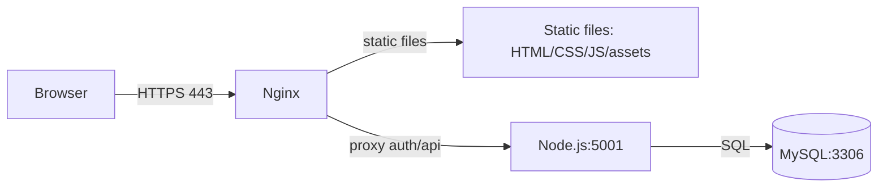

# Architecture

## Table of Contents

- [Project Overview](#project-overview)
- [File Structure](#file-structure)
- [System Architecture](#system-architecture)
- [Request Flow](#request-flow)
- [Authentication Flow](#authentication-flow)
- [Database Schema](#database-schema)
- [API Endpoints](#api-endpoints)
- [Frontend Pages](#frontend-pages)
- [Backend Code Structure](#backend-code-structure)
- [Configuration Files](#configuration-files)
- [Nginx Configuration](#nginx-configuration)
- [Session Management Deep Dive](#session-management-deep-dive)
- [Development Workflow](#development-workflow)
- [Deployment Checklist](#deployment-checklist)
- [Troubleshooting Guide](#troubleshooting-guide)
- [Security Notes](#security-notes)
- [Performance Considerations](#performance-considerations)
- [Future Enhancements](#future-enhancements)
- [Quick Reference Commands](#quick-reference-commands)

## Project Overview

RadiLinks is a static frontend site with a Node.js backend that provides authentication
(email/password + Google OAuth) and profile APIs. Users start on the public landing page,
sign in via `signup.html`, and land on `dashboard.html` once authenticated.

Why this architecture:
- Static HTML is fast and simple to deploy.
- Nginx serves static assets efficiently and reverse-proxies dynamic requests to Node.
- Session cookies allow a classic login experience without storing tokens in the browser.

User journey:
1) Visit landing page `index.html`
2) Go to `signup.html` to log in or create an account
3) Redirect to `/dashboard` (served by Node) after login
4) Dashboard fetches `/api/profile` to populate UI

## File Structure

```
/var/www/mysite1/
├── index.html
├── signup.html
├── dashboard.html
├── account-settings.html
├── Script.js
├── Style.css
├── assets/
│   ├── logo.png
│   └── favicon/...
├── backend/
│   ├── server.js
│   ├── config/
│   │   ├── db.js
│   │   ├── sessionConfig.js
│   │   └── passportConfig.js
│   ├── routes/
│   │   ├── authRoutes.js
│   │   └── userRoutes.js
│   ├── middleware/
│   │   └── authMiddleware.js
│   ├── models/
│   │   └── userStore.js
│   ├── uploads/
│   ├── utils/
│   │   └── responses.js
│   ├── .env
│   ├── .env.example
│   ├── package.json
│   └── ecosystem.config.js
└── .gitignore
```

Key files:
- `index.html`: Public landing page (static).
- `signup.html`: Login/signup UI (static); uses `Script.js` to post to `/login` or `/signup`.
- `dashboard.html`: Authenticated UI; calls `/api/profile`.
- `account-settings.html`: Profile editor; calls `/api/profile`, `/update-profile`, `/delete-account`.
- `Script.js`: Frontend behavior, auth requests, page switch logic.
- `backend/server.js`: Express entry point, session config, routes.
- `backend/config/sessionConfig.js`: Session cookie settings.
- `backend/routes/authRoutes.js`: Signup/login/Google OAuth.
- `backend/routes/userRoutes.js`: Protected pages and profile APIs.

## System Architecture

ASCII diagram:
```
[Browser]
   |
   | HTTPS (443)
   v
[Nginx]
   |-- serves static files (index.html, Script.js, assets/*)
   |
   |-- proxies /login, /signup, /auth/*, /dashboard, /api/* to:
   v
[Node.js / Express @ :5001]
   |
   |-- MySQL queries
   v
[MySQL @ :3306]
```

Mermaid diagram:


Why Nginx:
- Fast static file serving.
- TLS termination.
- Reverse proxy for backend on private port.

## Request Flow

Example: Email login request cycle.

ASCII:
```
User clicks "Log In"
  -> Script.js POST /login
  -> Nginx (443) proxies to Node (5001)
  -> authRoutes.js verifies credentials via MySQL
  -> req.session.user set, session saved
  -> Set-Cookie: networkrad.sid=...
  -> 302 to /dashboard
  -> Browser requests /dashboard (cookie included)
  -> userRoutes.js serves dashboard.html
  -> dashboard.html fetches /api/profile
  -> userRoutes.js returns JSON profile
```

Mermaid sequence:
```mermaid
sequenceDiagram
  participant U as Browser
  participant N as Nginx
  participant A as Node/Express
  participant DB as MySQL
  U->>N: POST /login
  N->>A: proxy /login
  A->>DB: SELECT user by email
  DB-->>A: user record
  A-->>U: Set-Cookie networkrad.sid; redirect /dashboard
  U->>N: GET /dashboard (cookie)
  N->>A: proxy /dashboard
  A-->>U: dashboard.html
  U->>N: GET /api/profile (cookie)
  N->>A: proxy /api/profile
  A-->>U: JSON profile
```

## Authentication Flow

### Email/Password Login

Relevant frontend snippet from `Script.js`:
```js
handleRequest({
  url: '/login',
  body: { email, password },
  submitBtn: loginSubmit,
  errorEl: loginError,
  successMessage: 'Signing you in...'
});
```

Backend snippet from `backend/routes/authRoutes.js`:
```js
const profile = await ensureProfileRecord(user);
req.session.user = buildSessionUser(profile);
req.session.tokens = null;

await persistSession(req);
return sendAuthSuccess(req, res);
```

Flow:
1) User submits login form in `signup.html`.
2) `Script.js` posts credentials to `/login`.
3) Backend verifies password and builds a session.
4) Session cookie `networkrad.sid` is set.
5) Redirect to `/dashboard`.
6) `/dashboard` is protected by `ensureAuthenticated`.

### Google OAuth Login

Backend snippet from `backend/routes/authRoutes.js`:
```js
router.get('/auth/google', passport.authenticate('google', {
  scope: googleScopes,
  accessType: 'offline',
  prompt: 'consent'
}));
```

Flow:
1) User clicks Google button.
2) Redirect to `/auth/google`.
3) Google redirects back to `/auth/google/callback`.
4) Backend stores/updates user, sets session, redirects to `/dashboard`.

## Database Schema

The code uses MySQL via `backend/config/db.js`. Inferred schema from `backend/models/userStore.js`:

```sql
CREATE TABLE users (
  id INT PRIMARY KEY AUTO_INCREMENT,
  email VARCHAR(255) UNIQUE NOT NULL,
  password VARCHAR(255),
  googleId VARCHAR(255),
  name VARCHAR(255),
  profilePhoto VARCHAR(255),
  created_at TIMESTAMP DEFAULT CURRENT_TIMESTAMP
);
```

Notes:
- `password` is nullable for Google users.
- `googleId` is nullable for email users.
- `profilePhoto` stores a path like `uploads/<file>` or a remote URL.
- Actual schema should be verified directly in MySQL.

## API Endpoints

Source: `backend/routes/authRoutes.js` and `backend/routes/userRoutes.js`.

| Method | Endpoint | Auth | Purpose |
|-------|----------|------|---------|
| POST | /signup | No | Create new account |
| POST | /login | No | Email/password login |
| GET | /auth/google | No | Start Google OAuth |
| GET | /auth/google/callback | No | OAuth callback |
| GET | /api/me | Yes | Current session user |
| GET | /api/profile | Yes | Profile data |
| POST | /update-profile | Yes | Update profile + photo |
| DELETE | /delete-account | Yes | Delete user |
| GET | /logout | Yes | End session |
| GET | /dashboard | Yes | Serve dashboard HTML |
| GET | /account-settings | Yes | Serve account settings HTML |

Example curl:
```bash
curl -i -X POST https://radilinks.com/login \
  -H "Content-Type: application/json" \
  -d '{"email":"user@example.com","password":"secret"}'
```

## Frontend Pages

### index.html
- Purpose: public landing page.
- Auth: not required.
- Key behaviors: loads `Script.js`, shows page switch if session exists.

### signup.html
- Purpose: login/signup gateway.
- Auth: not required.
- Key behaviors: email login/signup + Google OAuth via `Script.js`.

### dashboard.html
- Purpose: authenticated user dashboard.
- Auth: required; protected by `/dashboard` route.
- Key behaviors: fetches `/api/profile` and redirects to `/` if 401.

### account-settings.html
- Purpose: profile settings and account deletion.
- Auth: required.
- Key behaviors: fetch profile, update profile, delete account.

## Backend Code Structure

### server.js
Responsibilities:
- Loads `.env` and config.
- Sets `trust proxy` in production.
- Initializes sessions, Passport, and routes.
- Serves static files.

Snippet:
```js
if (NODE_ENV === 'production') {
  app.set('trust proxy', 1);
}

app.use(createSession({ secret: SESSION_SECRET, nodeEnv: NODE_ENV, sameSite: SESSION_SAMESITE,
  secure: resolveBoolean(SESSION_SECURE), cookieDomain: SESSION_DOMAIN || resolveCookieDomain(resolvedBaseUrl) }));
```

### config/sessionConfig.js
Defines cookie flags:
```js
const cookie = {
  httpOnly: true,
  sameSite: resolvedSameSite,
  secure: resolvedSecure,
  maxAge: 1000 * 60 * 60 * 24
};
```

Why it matters:
- `Secure` ensures cookies are HTTPS-only.
- `SameSite=Lax` reduces CSRF risk without breaking normal navigation.
- `Domain=.radilinks.com` shares sessions across apex + www.

### middleware/authMiddleware.js
```js
if (req.session?.user) return next();
return res.redirect('/signup.html');
```
Why: ensures protected pages only load for authenticated users.

### routes/authRoutes.js
Handles login, signup, Google OAuth, and session creation.

### routes/userRoutes.js
Protected endpoints: `/dashboard`, `/account-settings`, `/api/profile`, etc.

## Configuration Files

### .env
Typical production values (do not commit this file):
```dotenv
PORT=5001
NODE_ENV=production
BASE_URL=https://radilinks.com
SESSION_SECRET=...long secret...
SESSION_DOMAIN=.radilinks.com
SESSION_SAMESITE=lax
SESSION_SECURE=true
GOOGLE_CLIENT_ID=...
GOOGLE_CLIENT_SECRET=...
GOOGLE_REDIRECT_URI=https://radilinks.com/auth/google/callback
DB_HOST=127.0.0.1
DB_USER=radlinks_user
DB_PASSWORD=...
DB_NAME=radlinks_db
DB_PORT=3306
```

### .env.example
Template for documenting required variables.

### ecosystem.config.js
Important config for PM2:
```js
{
  name: 'networkrad-backend',
  script: './server.js',
  instances: 1
}
```
Note: MemoryStore is not safe for multi-instance cluster mode without a shared store.

### .gitignore
Excludes `.env` and `node_modules` to protect secrets and avoid committing dependencies.

## Nginx Configuration

Example proxy configuration:
```nginx
location ~ ^/(login|signup|logout|auth|dashboard|account-settings|api|update-profile|delete-account) {
  proxy_pass http://127.0.0.1:5001;
  proxy_set_header Host $host;
  proxy_set_header X-Forwarded-Proto $scheme;
  proxy_set_header X-Forwarded-Host $host;
  proxy_set_header X-Forwarded-For $proxy_add_x_forwarded_for;
  proxy_set_header X-Real-IP $remote_addr;
}
```

Why `X-Forwarded-Proto` matters:
- Express sets secure cookies only if it knows the request is HTTPS.
- Behind Nginx, `trust proxy` + `X-Forwarded-Proto` enables that.

## Session Management Deep Dive

How it works:
1) User logs in.
2) Backend sets `req.session.user`.
3) `express-session` creates a session ID.
4) Cookie sent to browser: `networkrad.sid=...`
5) Browser sends cookie on subsequent requests.
6) Backend resolves session and populates `req.session.user`.

Cookie details:
```
Name: networkrad.sid
Domain: .radilinks.com
Path: /
Secure: true
HttpOnly: true
SameSite: Lax
```

Why MemoryStore is limited:
- Sessions are stored in process memory.
- If the server restarts, sessions are lost.
- If you run multiple instances, sessions do not share state.

## Development Workflow

Frontend changes:
```bash
git add index.html Script.js Style.css
git commit -m "Update homepage"
git push origin main
```
Then on VPS:
```bash
cd /var/www/mysite1
git pull origin main
```

Backend changes:
```bash
git add backend/server.js
git commit -m "Update auth flow"
git push origin main
```
Then on VPS:
```bash
cd /var/www/mysite1/backend
git pull origin main
pm2 restart networkrad-backend --update-env
```

## Deployment Checklist

- Pull latest code from Git.
- Install dependencies if needed (`npm install`).
- Update `.env` manually on VPS (never commit secrets).
- Restart backend via PM2.
- Reload Nginx if config changed.

## Troubleshooting Guide

Login redirects back to sign-in:
- Check `Set-Cookie` header on `/login`.
- Ensure cookie name is `networkrad.sid`.
- Confirm cookie domain `.radilinks.com`.
- Confirm Nginx forwards `X-Forwarded-Proto`.

Dashboard 401 errors:
- Inspect `/api/me` and `/api/profile` responses.
- Confirm `ensureApiAuthenticated` returns JSON 401, not HTML.

## Security Notes

Current safeguards:
- HTTPS enforced via Nginx and Lets Encrypt.
- Session cookies use `Secure` and `HttpOnly`.
- Passwords hashed via bcrypt.
- SQL queries are parameterized.

## Performance Considerations

- Static files served by Nginx (fast).
- Single Node instance with MemoryStore (simple, not horizontally scalable).
- MySQL connection pooling enabled.

## Future Enhancements

- Use Redis for session storage.
- Add rate limiting on `/login`.
- Add email verification and password reset flow.
- Add structured logging (Winston or Pino).

## Quick Reference Commands

```bash
# Pull latest code
git pull origin main

# Restart backend
pm2 restart networkrad-backend --update-env

# Nginx config test + reload
sudo nginx -t
sudo systemctl reload nginx

# Check logs
pm2 logs --lines 50

# Check backend port
ss -tlnp | grep 5001
```
